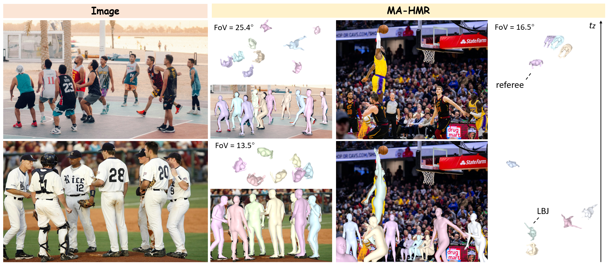
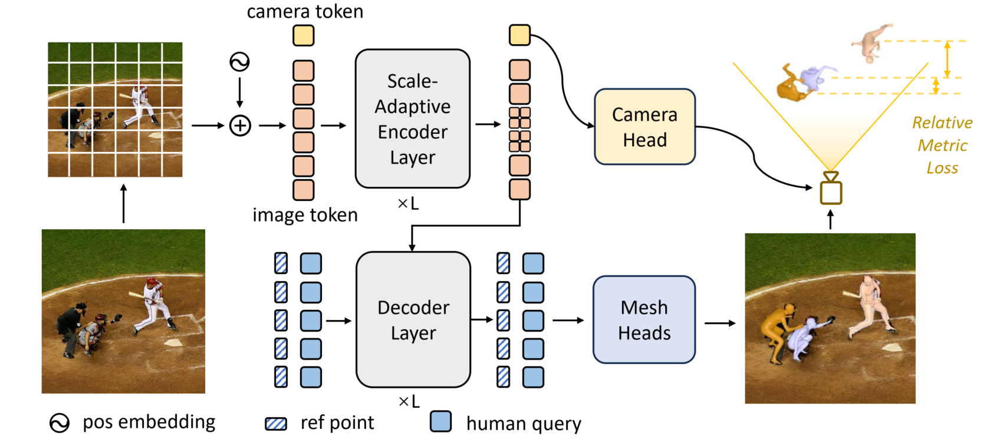

# MA-HMR

[](http://arxiv.org/abs/2511.13282)
[](https://github.com/gouba2333/DTO-Humans.git)

This repository contains the official implementation of **M**etric-**A**ware **HMR** for the paper *Towards Metric-Aware Multi-Person Mesh Recovery by Jointly Optimizing Human Crowd in Camera Space*. The official implementation of **DTO** framework and **DTO-Humans** dataset is available at [DTO-Humans](https://github.com/gouba2333/DTO-Humans.git)



<h3> Overview of MA-HMR </h3>


We propose Metric-Aware HMR, an end-to-end network that directly estimates human mesh and camera parameters in metric scale. This is enabled by a camera branch and a novel relative metric loss that enforces plausible relative scales.
<!-- <p align="center">
  
</p> -->


## Installation

We follow [SAT-HMR](https://github.com/ChiSu001/SAT-HMR), testing with python 3.11, PyTorch 2.4.1 and CUDA 12.1.

1. Clone the repo and create a conda environment.
```bash
conda create -n mahmr python=3.11 -y
conda activate mahmr
```

2. Install [PyTorch](https://pytorch.org/) and [xFormers](https://github.com/facebookresearch/xformers).
```bash
# Install PyTorch. It is recommended that you follow [official instruction](https://pytorch.org/) and adapt the cuda version to yours.
conda install pytorch==2.4.1 torchvision==0.19.1 torchaudio==2.4.1 pytorch-cuda=12.1 -c pytorch -c nvidia

# Install xFormers. It is recommended that you follow [official instruction](https://github.com/facebookresearch/xformers) and adapt the cuda version to yours.
pip install -U xformers==0.0.28.post1  --index-url https://download.pytorch.org/whl/cu121
```

3. Install other dependencies.
```bash
pip install -r requirements.txt
```

4. You may need to modify `chumpy` package to avoid errors. For detailed instructions, please check [this guidance](https://github.com/ChiSu001/SAT-HMR/blob/main/docs/fix_chumpy.md).

## Download Models & Weights

1. Download SMPL-related weights and place them in `weights/smpl_data/smpl/`. Partially Available at [this link](https://drive.google.com/drive/folders/1C8fZNiiZfC1oMUZq7xNilQcGv4LJf5M8?usp=drive_link). You need to register on the [SMPL website](https://smpl.is.tue.mpg.de/) to get other part of them.

```
weights/
└── smpl_data/
    └── smpl/
        ├── body_verts_smpl.npy
        ├── J_regressor_h36m_correct.npy
        ├── J_regressor_extra.npy
        ├── smpl_mean_params.npz
        ├── SMPL_FEMALE.pkl
        ├── SMPL_MALE.pkl
        ├── SMPL_NEUTRAL.pkl
        └── smpl_kid_template.npy
```

2. Download DINOv2 pretrained weights from [their official repository](https://github.com/facebookresearch/dinov2?tab=readme-ov-file#pretrained-models). We use `ViT-B/14 distilled (without registers)`. Please put `dinov2_vitb14_pretrain.pth` to `weights/dinov2`. These weights will be used to initialize our encoder. You can skip this step if you are not going to train MA-HMR.
```
weights/
└── dinov2
    └── dinov2_vitb14_pretrain.pth
```

3. Download pretrained weights of **SAT-HMR stage1** from [Google drive](https://drive.google.com/drive/folders/1L09zt5lQ2RVK2MS2DwKODpdTs9K6CQPC?usp=sharing) or [🤗HuggingFace](https://huggingface.co/ChiSu001/SAT-HMR/tree/main/weights/sat_hmr). Please put them to `weights/sat_hmr`. You can skip this step if you are not going to train MA-HMR.
```
weights
└── sat_hmr
    └── sat_644.pth
```

4. Download pretrained weights of MA-HMR from [Google Drive](https://drive.google.com/drive/folders/1CaQOaQZ94ot91D_kqhvasfRb-utpfKmM?usp=drive_link) and put them to `weights/ma_hmr`. You can only prepare mahmr_stage3.bin for inference or evaluation.
* **mahmr_stage1.bin**: trained on AGORA, BEDLAM and CameraHMR's version of 4D-humans pGTs (supervision on 2D kps) for 5 epochs with denoising strategy and without camera branch.
* **mahmr_stage2.bin**: trained on AGORA, BEDLAM and CameraHMR's version of 4D-humans pGTs (supervision on 2D kps) for 5 epochs with camera branch and fov loss.
* **mahmr_stage3.bin**: trained on AGORA, BEDLAM and **DTO-Humans** for 5 epochs with camera branch and full loss.
 for inference and evaluation from [Google drive](https://drive.google.com/drive/folders/1L09zt5lQ2RVK2MS2DwKODpdTs9K6CQPC?usp=sharing)

```
weights
└── ma_hmr
    ├── mahmr_stage1.bin
    ├── mahmr_stage2.bin
    └── mahmr_stage3.bin
```


## Data Preparation

Please follow [this guidance](https://github.com/ChiSu001/SAT-HMR/blob/main/docs/data_preparation.md) to prepare AGORA, BEDLAM, 3DPW. Placing all datasets in `data/`. The `*_CHMR_SMPL.npz` files are the reorgnized [CameraHMR's](https://camerahmr.is.tue.mpg.de/) annotation of 4D-humans dataset. The `*_CHMR_SMPL_OPT.npz` files are our [DTO-Humans](https://github.com/gouba2333/DTO-Humans.git) annotations.
 You can skip this step if you are not going to train or evaluate MA-HMR.

```
data/
├── 3dpw/
├── agora/
├── aic/
│   ├── images/
│   ├── aic-release.npz
│   ├── AIC_CHMR_SMPL.npz
│   └── AIC_CHMR_SMPL_OPT.npz
├── bedlam/
├── cmu_panoptic/
├── coco2014/
│   ├── images/
│   │   └── train2014/
│   ├── coco-release.npz
│   ├── COCO_CHMR_SMPL.npz
│   └── COCO_CHMR_SMPL_OPT.npz
├── hi4d/
├── insta/
│   ├── images/
│   │   └── insta-train/
│   ├── insta1-release.npz
│   ├── insta2-release.npz
│   ├── INSTA_CHMR_SMPL.npz
│   └── INSTA_CHMR_SMPL_OPT.npz
├── mpii/
│   ├── images/
│   ├── mpii-release.npz
│   ├── MPII_CHMR_SMPL.npz
│   └── MPII_CHMR_SMPL_OPT.npz
├── mupots/
└── RelativeHuman/
```


## Inference on Images
<h4> Inference with 1 GPU</h4>

We provide some demo images in `demo/`. You can run MA-HMR on all images on a single GPU via:


```bash
python main.py --mode infer --cfg demo
```

Results with overlayed meshes will be saved in `${Project}/demo_results`.

You can specify your own inference configuration by modifing `configs/run/demo.yaml`:

- `input_dir` specifies the input image folder.
- `output_dir` specifies the output folder.
- `conf_thresh` specifies a list of confidence thresholds used for detection. SAT-HMR will run inference using thresholds in the list, respectively.
- `infer_batch_size` specifies the batch size used for inference (on a single GPU).

<h4> Inference with Multiple GPUs</h4>

You can also try distributed inference on multiple GPUs if your input folder contains a large number of images. 
Since we use [🤗 Accelerate](https://huggingface.co/docs/accelerate/index) to launch our distributed configuration, first you may need to configure [🤗 Accelerate](https://huggingface.co/docs/accelerate/index) for how the current system is setup for distributed process. To do so run the following command and answer the questions prompted to you:

```bash
accelerate config
```

Then run:
```bash
accelerate launch main.py --mode infer --cfg demo
```

## Training

<h4> Training with Multiple GPUs</h4>

We use [🤗 Accelerate](https://huggingface.co/docs/accelerate/index) to launch our distributed configuration, first you may need to configure [🤗 Accelerate](https://huggingface.co/docs/accelerate/index) for how the current system is setup for distributed process. To do so run the following command and answer the questions prompted to you:

```bash
accelerate config
```

```bash
# stage 1
accelerate launch main.py --mode train --cfg train_chmr

# stage 2
accelerate launch main.py --mode train --cfg train_chmr_fov_continue

# stage 3
accelerate launch main.py --mode train --cfg train_chmr_fov_opt_mloss

# finetune
accelerate launch main.py --mode train --cfg 3dpw_ft
```

<h4> Monitor Training Progress</h4>

Training logs and checkpoints will be saved in the `${Project}/outputs/logs` and `${Project}/outputs/ckpts` directories, respectively.

You can monitor the training progress using TensorBoard. To start TensorBoard, run:

```bash
tensorboard --logdir=${Project}/outputs/logs
```

## Evaluation

<h4> Evaluation with 1 GPU</h4>

```bash
# Evaluate on rh
python main.py --mode eval --cfg eval_rh
```

<h4> Evaluation with Multiple GPUs</h4>

We recommend using a single GPU for evaluation as it provides more accurate results. However, we also provide code for distributed evaluation to obtain results faster.

```bash
# Multi-GPU configuration
accelerate config
# Evaluation
accelerate launch main.py --mode eval --cfg ${cfg_name}
```

## 📜 Citation
If you find our work useful, please consider citing our paper:

```bibtex
@article{wang2025dtohumans,
  title={Towards Metric-Aware Multi-Person Mesh Recovery by Jointly Optimizing Human Crowd in Camera Space},
  author={Kaiwen Wang, Kaili Zheng, Yiming Shi, Chenyi Guo, Ji Wu},
  journal={arXiv preprint arXiv:2511.13282},
  year={2025}
}
```

## 🙏 Acknowledgements

This project builds upon several amazing open-source projects and datasets. We would like to thank the authors of:
*   [SAT-HMR](https://github.com/ChiSu001/SAT-HMR)
*   [CameraHMR](https://camerahmr.is.tue.mpg.de/)
*   [DINOv2](https://github.com/facebookresearch/dinov2)
*   [Accelerate](https://huggingface.co/docs/accelerate/index)